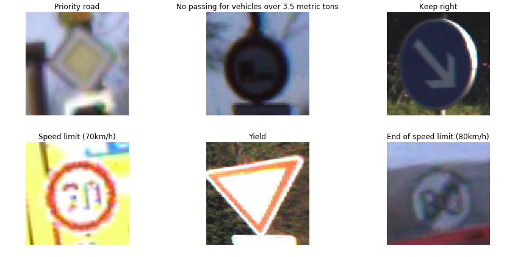
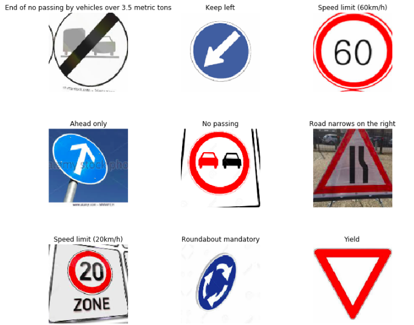

# SigNet
> A Convolutional Neural Network that accurately recognizes 43 different traffic signs.

> The model has been deployed on [render](https://signet-283b.app.render.com/). You can test it on your own images [there](https://signet-283b.app.render.com/). The accompanying code for the web application can be found [here](https://github.com/asiedubrempong/SigNet-app)

## Table of Contents
* [Motivation](#motivation)
* [Dataset](#dataset)
* [Project Information](#project-information)
* [Technologies](#technologies)

## Motivation
Recognition of traffic signs is a challenging real-world problem of high industrial relevance. As autonomous vehicles, such as Google’s ‘self-driving car,’ become more prominent, the ability to detect and recognize informational road signs is of elevated importance. Road sign detection and classification faces the same challenges as many other detection tasks, namely that of shadows and outdoor lighting conditions obscuring the signs. A useful detector must, therefore, be able to cope with rotation, different lighting conditions, perspective changes, occlusion and all kinds of weather conditions. 

## Dataset
For the recognition of traffic signs, the dataset used is from the [German Traffic Sign Recognition Benchmark](http://benchmark.ini.rub.de/?section=gtsrb&subsection=dataset)
The training set contains 31368 images in 43 classes. A test set which has 12630 images is also provided.

However it can be observed that for most of the images in the dataset, the contrast low. To be able to build a model that works well on images from other sources, I created a supplementary dataset consisting of images scraped from the web. The model is fine-tuned on this dataset after it has been trained on the German Traffic Signs Dataset.

## Project information
A pretrained resnet50 architecture is used to perform transfer learning on the dataset. These techniques were used for the trainig of the model:
* [One cycle policy](https://arxiv.org/abs/1803.09820)
* Progressive resizing

SigNet achieves an accuracy of 99.37% on the test set.

## Technologies
The project is built with:
* Python 3.6+
* [Fastai](http://docs.fast.ai/): An awesome deep learning library that is built on top of PyTorch
